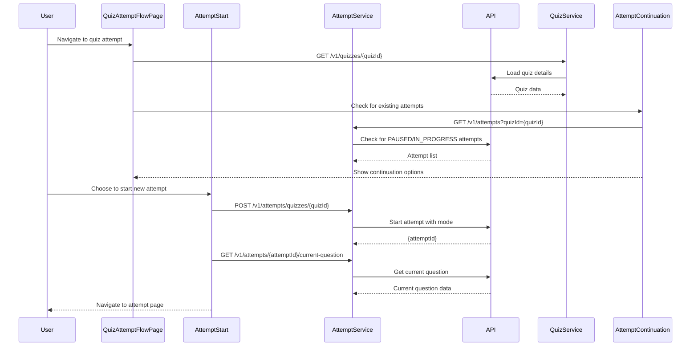
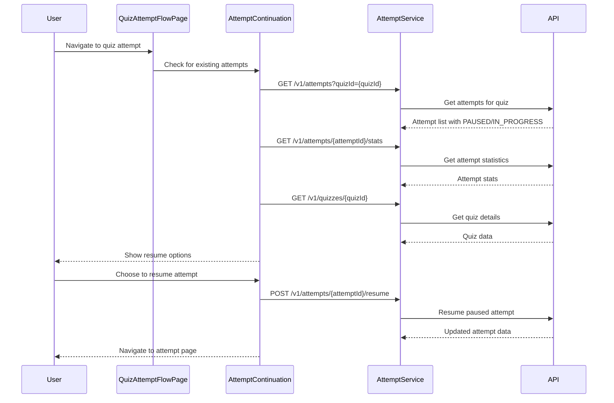
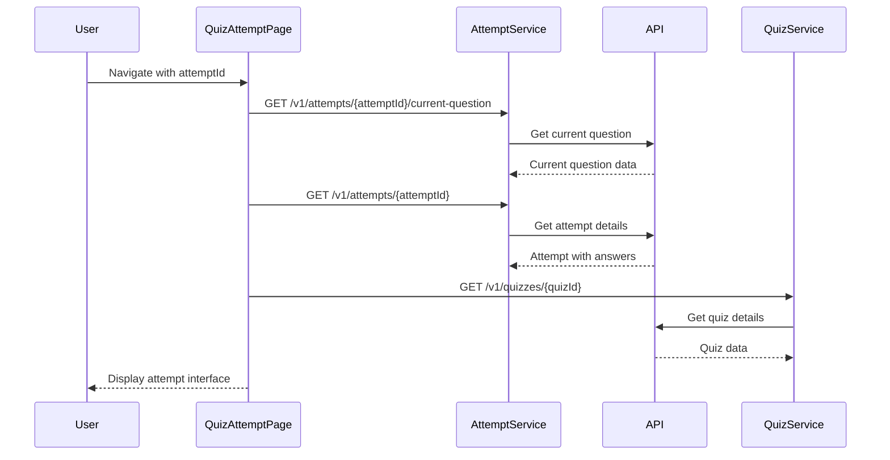
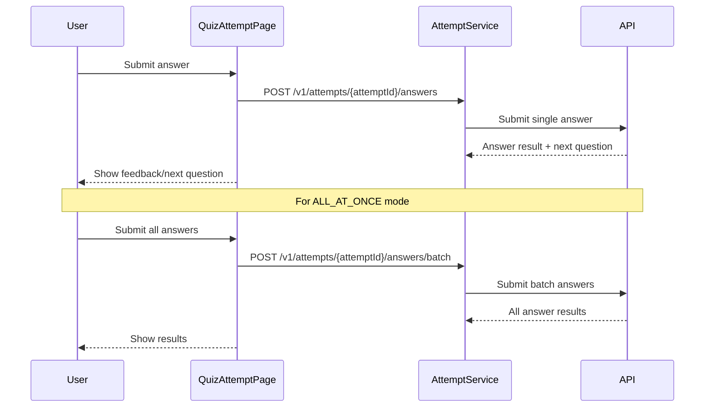

# Quiz Attempt API Flow Documentation

This document details the complete API flow for quiz attempts based on the actual frontend implementation in the QuizMaker application.

## Table of Contents

1. [Overview](#overview)
2. [API Endpoints](#api-endpoints)
3. [Attempt Flow Scenarios](#attempt-flow-scenarios)
4. [Request/Response Examples](#requestresponse-examples)
5. [Error Handling](#error-handling)

## Overview

The quiz attempt system supports three modes:
- **ONE_BY_ONE**: Questions presented one at a time with immediate feedback
- **ALL_AT_ONCE**: All questions visible, submit everything at once
- **TIMED**: Timed attempt with countdown timer

**Note**: Starting a new attempt now requires two API calls:
1. `POST /v1/attempts/quizzes/{quizId}` - Creates the attempt
2. `GET /v1/attempts/{attemptId}/current-question` - Gets the first question

This ensures consistency between the question ID returned and the question ID expected for the first answer submission.

## API Endpoints

### Base URL
All endpoints are prefixed with `/api`

### Authentication
All endpoints require Bearer token authentication via the `Authorization` header.

## Attempt Flow Scenarios

### 1. Starting a New Attempt

#### Flow: QuizAttemptFlowPage → AttemptStart → API



#### API Calls:

1. **GET `/v1/quizzes/{quizId}`** - Load quiz details
2. **GET `/v1/attempts?quizId={quizId}`** - Check for existing attempts
3. **POST `/v1/attempts/quizzes/{quizId}`** - Start new attempt
4. **GET `/v1/attempts/{attemptId}/current-question`** - Get current question for new attempt

### 2. Continuing/Resuming an Attempt

#### Flow: QuizAttemptFlowPage → AttemptContinuation → API



#### API Calls:

1. **GET `/v1/attempts?quizId={quizId}`** - Get attempts for quiz
2. **GET `/v1/attempts/{attemptId}/stats`** - Get attempt statistics
3. **GET `/v1/quizzes/{quizId}`** - Get quiz details
4. **POST `/v1/attempts/{attemptId}/resume`** - Resume paused attempt

### 3. Loading Attempt Data (QuizAttemptPage)

#### Flow: QuizAttemptPage → API



#### API Calls:

1. **GET `/v1/attempts/{attemptId}/current-question`** - Get current question
2. **GET `/v1/attempts/{attemptId}`** - Get attempt details with answers
3. **GET `/v1/quizzes/{quizId}`** - Get quiz details

### 4. During Attempt (Answer Submission)

#### Flow: User Interaction → API



#### API Calls:

1. **POST `/v1/attempts/{attemptId}/answers`** - Submit single answer
2. **POST `/v1/attempts/{attemptId}/answers/batch`** - Submit batch answers (ALL_AT_ONCE mode)

## Request/Response Examples

### 1. Start Attempt

#### Request
```http
POST /api/v1/attempts/quizzes/{quizId}
Content-Type: application/json
Authorization: Bearer {access_token}
```

#### Request Body
```json
{
  "mode": "ONE_BY_ONE"
}
```

#### Response
```json
{
  "attemptId": "3fa85f64-5717-4562-b3fc-2c963f66afa6"
}
```

### 2. Get Attempts (Check for Existing)

#### Request
```http
GET /api/v1/attempts?quizId={quizId}&page=0&size=20
Authorization: Bearer {access_token}
```

#### Response
```json
{
  "content": [
    {
      "attemptId": "3fa85f64-5717-4562-b3fc-2c963f66afa6",
      "quizId": "1c2d3e4f-5a6b-7c8d-9e0f-1a2b3c4d5e6f",
      "userId": "9f8e7d6c-5b4a-3c2d-1b0a-9f8e7d6c5b4a",
      "startedAt": "2025-05-20T14:30:00Z",
      "status": "PAUSED",
      "mode": "ONE_BY_ONE"
    }
  ],
  "totalElements": 1,
  "totalPages": 1,
  "size": 20,
  "number": 0
}
```

### 3. Get Attempt Statistics

#### Request
```http
GET /api/v1/attempts/{attemptId}/stats
Authorization: Bearer {access_token}
```

#### Response
```json
{
  "attemptId": "3fa85f64-5717-4562-b3fc-2c963f66afa6",
  "totalTime": "PT15M30S",
  "averageTimePerQuestion": "PT3M6S",
  "questionsAnswered": 5,
  "correctAnswers": 4,
  "accuracyPercentage": 80.0,
  "completionPercentage": 50.0,
  "questionTimings": [
    {
      "questionId": "3fa85f64-5717-4562-b3fc-2c963f66afa6",
      "questionType": "MCQ_SINGLE",
      "difficulty": "MEDIUM",
      "timeSpent": "PT2M30S",
      "isCorrect": true,
      "questionStartedAt": "2025-01-27T10:30:00Z",
      "answeredAt": "2025-01-27T10:32:30Z"
    }
  ],
  "startedAt": "2025-01-27T10:30:00Z",
  "completedAt": null
}
```

### 4. Resume Attempt

#### Request
```http
POST /api/v1/attempts/{attemptId}/resume
Authorization: Bearer {access_token}
```

#### Response
```json
{
  "attemptId": "3fa85f64-5717-4562-b3fc-2c963f66afa6",
  "quizId": "1c2d3e4f-5a6b-7c8d-9e0f-1a2b3c4d5e6f",
  "userId": "9f8e7d6c-5b4a-3c2d-1b0a-9f8e7d6c5b4a",
  "startedAt": "2025-05-20T14:30:00Z",
  "status": "IN_PROGRESS",
  "mode": "ONE_BY_ONE"
}
```

### 5. Get Current Question

#### Request
```http
GET /api/v1/attempts/{attemptId}/current-question
Authorization: Bearer {access_token}
```

#### Response
```json
{
  "question": {
    "id": "3fa85f64-5717-4562-b3fc-2c963f66afa6",
    "type": "MCQ_SINGLE",
    "difficulty": "MEDIUM",
    "questionText": "What is the capital of France?",
    "safeContent": {
      "question": "What is the capital of France?",
      "options": ["London", "Berlin", "Paris", "Madrid"]
    },
    "hint": "Think about European geography",
    "attachmentUrl": null
  },
  "questionNumber": 3,
  "totalQuestions": 10,
  "attemptStatus": "IN_PROGRESS"
}
```

### 6. Get Attempt Details

#### Request
```http
GET /api/v1/attempts/{attemptId}
Authorization: Bearer {access_token}
```

#### Response
```json
{
  "attemptId": "3fa85f64-5717-4562-b3fc-2c963f66afa6",
  "quizId": "1c2d3e4f-5a6b-7c8d-9e0f-1a2b3c4d5e6f",
  "userId": "9f8e7d6c-5b4a-3c2d-1b0a-9f8e7d6c5b4a",
  "startedAt": "2025-05-20T14:30:00Z",
  "completedAt": null,
  "status": "IN_PROGRESS",
  "mode": "ONE_BY_ONE",
  "answers": [
    {
      "answerId": "4b3a2c1d-0f9e-8d7c-6b5a-4c3b2a1d0e9f",
      "questionId": "abcdef12-3456-7890-abcd-ef1234567890",
      "isCorrect": true,
      "score": 1.0,
      "answeredAt": "2025-05-20T14:35:00Z"
    }
  ]
}
```

### 7. Submit Single Answer

#### Request
```http
POST /api/v1/attempts/{attemptId}/answers
Content-Type: application/json
Authorization: Bearer {access_token}
```

#### Request Body Examples

**MCQ Single Choice:**
```json
{
  "questionId": "abcdef12-3456-7890-abcd-ef1234567890",
  "response": {
    "selectedOptionId": "option_2"
  }
}
```

**MCQ Multiple Choice:**
```json
{
  "questionId": "abcdef12-3456-7890-abcd-ef1234567890",
  "response": {
    "selectedOptionIds": ["option_1", "option_3"]
  }
}
```

**True/False:**
```json
{
  "questionId": "abcdef12-3456-7890-abcd-ef1234567890",
  "response": {
    "answer": true
  }
}
```

**Open Answer:**
```json
{
  "questionId": "abcdef12-3456-7890-abcd-ef1234567890",
  "response": {
    "answer": "Paris is the capital of France"
  }
}
```

**Fill Gap:**
```json
{
  "questionId": "abcdef12-3456-7890-abcd-ef1234567890",
  "response": {
    "answers": [
      {
        "gapId": 1,
        "answer": "Paris"
      },
      {
        "gapId": 2,
        "answer": "France"
      }
    ]
  }
}
```

**Compliance:**
```json
{
  "questionId": "abcdef12-3456-7890-abcd-ef1234567890",
  "response": {
    "selectedStatementIds": ["statement_1", "statement_3"]
  }
}
```

**Hotspot:**
```json
{
  "questionId": "abcdef12-3456-7890-abcd-ef1234567890",
  "response": {
    "regionId": "region_2"
  }
}
```

**Ordering:**
```json
{
  "questionId": "abcdef12-3456-7890-abcd-ef1234567890",
  "response": {
    "orderedItemIds": ["item_3", "item_1", "item_2"]
  }
}
```

#### Response
```json
{
  "answerId": "4b3a2c1d-0f9e-8d7c-6b5a-4c3b2a1d0e9f",
  "questionId": "abcdef12-3456-7890-abcd-ef1234567890",
  "isCorrect": true,
  "score": 1.0,
  "answeredAt": "2025-05-20T14:35:00Z",
  "nextQuestion": {
    "id": "3fa85f64-5717-4562-b3fc-2c963f66afa6",
    "type": "MCQ_SINGLE",
    "difficulty": "MEDIUM",
    "questionText": "What is 2+2?",
    "safeContent": {
      "question": "What is 2+2?",
      "options": ["3", "4", "5", "6"]
    },
    "hint": "Basic arithmetic",
    "attachmentUrl": null
  }
}
```

### 8. Submit Batch Answers (ALL_AT_ONCE Mode)

#### Request
```http
POST /api/v1/attempts/{attemptId}/answers/batch
Content-Type: application/json
Authorization: Bearer {access_token}
```

#### Request Body
```json
{
  "answers": [
    {
      "questionId": "abcdef12-3456-7890-abcd-ef1234567890",
      "response": {
        "selectedOptionId": "option_2"
      }
    },
    {
      "questionId": "fedcba21-6543-0987-badc-fe6543210987",
      "response": {
        "answer": "4"
      }
    },
    {
      "questionId": "12345678-9abc-def0-1234-567890abcdef",
      "response": {
        "selectedOptionIds": ["option_1", "option_3"]
      }
    }
  ]
}
```

#### Response
```json
[
  {
    "answerId": "4b3a2c1d-0f9e-8d7c-6b5a-4c3b2a1d0e9f",
    "questionId": "abcdef12-3456-7890-abcd-ef1234567890",
    "isCorrect": true,
    "score": 1.0,
    "answeredAt": "2025-05-20T14:35:00Z"
  },
  {
    "answerId": "5c4b3a2d-1g0f-9e8d-7c6b-5d4c3b2e1f0g",
    "questionId": "fedcba21-6543-0987-badc-fe6543210987",
    "isCorrect": true,
    "score": 1.0,
    "answeredAt": "2025-05-20T14:35:01Z"
  },
  {
    "answerId": "6d5c4b3e-2h1g-0f9e-8d7c-6e5d4c3f2g1h",
    "questionId": "12345678-9abc-def0-1234-567890abcdef",
    "isCorrect": false,
    "score": 0.0,
    "answeredAt": "2025-05-20T14:35:02Z"
  }
]
```

### 9. Complete Attempt

#### Request
```http
POST /api/v1/attempts/{attemptId}/complete
Authorization: Bearer {access_token}
```

#### Response
```json
{
  "attemptId": "3fa85f64-5717-4562-b3fc-2c963f66afa6",
  "quizId": "1c2d3e4f-5a6b-7c8d-9e0f-1a2b3c4d5e6f",
  "userId": "9f8e7d6c-5b4a-3c2d-1b0a-9f8e7d6c5b4a",
  "startedAt": "2025-05-20T14:30:00Z",
  "completedAt": "2025-05-20T14:45:00Z",
  "totalScore": 8.0,
  "correctCount": 8,
  "totalQuestions": 10,
  "answers": [
    {
      "answerId": "4b3a2c1d-0f9e-8d7c-6b5a-4c3b2a1d0e9f",
      "questionId": "abcdef12-3456-7890-abcd-ef1234567890",
      "isCorrect": true,
      "score": 1.0,
      "answeredAt": "2025-05-20T14:35:00Z"
    }
  ]
}
```

### 10. Pause Attempt

#### Request
```http
POST /api/v1/attempts/{attemptId}/pause
Authorization: Bearer {access_token}
```

#### Response
```json
{
  "attemptId": "3fa85f64-5717-4562-b3fc-2c963f66afa6",
  "quizId": "1c2d3e4f-5a6b-7c8d-9e0f-1a2b3c4d5e6f",
  "userId": "9f8e7d6c-5b4a-3c2d-1b0a-9f8e7d6c5b4a",
  "startedAt": "2025-05-20T14:30:00Z",
  "status": "PAUSED",
  "mode": "ONE_BY_ONE"
}
```

### 11. Get Shuffled Questions

#### Request
```http
GET /api/v1/attempts/quizzes/{quizId}/questions/shuffled
Authorization: Bearer {access_token}
```

#### Response
```json
[
  {
    "id": "3fa85f64-5717-4562-b3fc-2c963f66afa6",
    "type": "MCQ_SINGLE",
    "difficulty": "MEDIUM",
    "questionText": "What is the capital of France?",
    "safeContent": {
      "question": "What is the capital of France?",
      "options": ["London", "Berlin", "Paris", "Madrid"]
    },
    "hint": "Think about European geography",
    "attachmentUrl": null
  },
  {
    "id": "4fa85f64-5717-4562-b3fc-2c963f66afa7",
    "type": "TRUE_FALSE",
    "difficulty": "EASY",
    "questionText": "Is Paris the capital of France?",
    "safeContent": {
      "question": "Is Paris the capital of France?"
    },
    "hint": null,
    "attachmentUrl": null
  }
]
```

## Error Handling

### Common Error Responses

#### 400 Bad Request - Validation Error
```json
{
  "timestamp": "2025-01-27T10:30:00Z",
  "status": 400,
  "error": "Bad Request",
  "details": ["Question ID is required", "Response cannot be empty"]
}
```

#### 401 Unauthorized
```json
{
  "timestamp": "2025-01-27T10:30:00Z",
  "status": 401,
  "error": "Unauthorized",
  "details": ["Authentication required"]
}
```

#### 404 Not Found
```json
{
  "timestamp": "2025-01-27T10:30:00Z",
  "status": 404,
  "error": "Not Found",
  "details": ["Attempt not found"]
}
```

#### 409 Conflict - State Conflict
```json
{
  "timestamp": "2025-01-27T10:30:00Z",
  "status": 409,
  "error": "Conflict",
  "details": ["Attempt is already completed"]
}
```

### HTTP Status Codes

- **200 OK**: Successful operation
- **201 Created**: Resource created successfully
- **400 Bad Request**: Validation errors, invalid request data
- **401 Unauthorized**: Missing or invalid authentication token
- **403 Forbidden**: Authenticated but insufficient permissions
- **404 Not Found**: Resource not found (quiz, attempt, question)
- **409 Conflict**: State conflicts (attempt already completed, duplicate answers)
- **422 Unprocessable Entity**: Business logic validation failures
- **500 Internal Server Error**: Unexpected server errors

## Key Endpoint Summary

| **Operation** | **Method** | **Endpoint** | **Purpose** |
|---------------|------------|--------------|-------------|
| Start Attempt | POST | `/v1/attempts/quizzes/{quizId}` | Create new attempt |
| Resume Attempt | POST | `/v1/attempts/{attemptId}/resume` | Resume paused attempt |
| Get Current Question | GET | `/v1/attempts/{attemptId}/current-question` | Get current question |
| Get Attempt Details | GET | `/v1/attempts/{attemptId}` | Get attempt with answers |
| Submit Answer | POST | `/v1/attempts/{attemptId}/answers` | Submit single answer |
| Submit Batch | POST | `/v1/attempts/{attemptId}/answers/batch` | Submit multiple answers |
| Pause Attempt | POST | `/v1/attempts/{attemptId}/pause` | Pause attempt |
| Complete Attempt | POST | `/v1/attempts/{attemptId}/complete` | Finish attempt |
| Get Attempt Stats | GET | `/v1/attempts/{attemptId}/stats` | Get attempt statistics |
| Get Attempts | GET | `/v1/attempts` | List attempts with filtering |
| Get Shuffled Questions | GET | `/v1/attempts/quizzes/{quizId}/questions/shuffled` | Get questions for attempt |
| Delete Attempt | DELETE | `/v1/attempts/{attemptId}` | Delete attempt |

## Notes

1. **Authentication**: All endpoints require a valid Bearer token in the Authorization header
2. **Question Types**: The system supports multiple question types with different response formats
3. **Attempt Modes**: Different modes have different submission patterns (single vs batch)
4. **State Management**: Attempts can be paused and resumed, maintaining progress
5. **Error Handling**: Consistent error response format across all endpoints
6. **Progress Tracking**: Real-time statistics and progress information available 